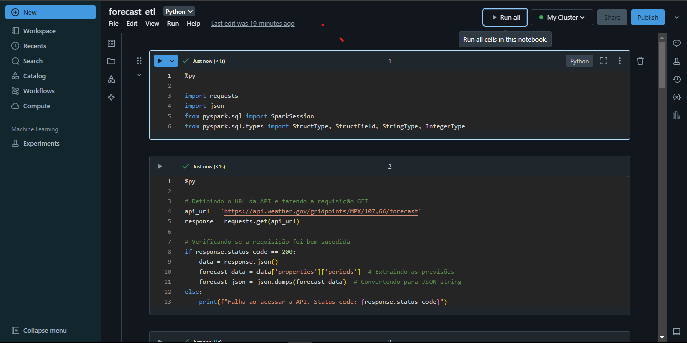

# Weather Data Integration and Processing Project

## Project Description

This project was developed for study purposes in **Apache Spark** and **Databricks**. The main objective is to demonstrate the process of ingesting, transforming, and storing meteorological data obtained from an external API using an ELT (Extract, Load, Transform) data pipeline.

## Objectives

1. **Data Ingestion**:
   - Consume meteorological data from the **National Weather Service (NWS)** API.
   - The API provides weather forecasts in JSON format.

2. **Processing and Transformation**:
   - **Extract** data from the API and **load** it into the **Bronze Layer**.
   - **Transform** the data for cleaning and preparation, and **load** it into the **Silver Layer**.

3. **Storage**:
   - Store the data in two layers:
     - **Bronze Layer**: Raw data.
     - **Silver Layer**: Transformed data ready for analysis.

## Project Steps

### 1. Importing Libraries and Requesting Data from the API

- Use Python libraries such as `requests` to fetch data from the API and `pyspark` for processing with Spark.
- Perform a GET request to the API to obtain meteorological data.

### 2. Data Extraction and Loading

- Extract JSON data from the API response.
- Create a Spark DataFrame to store the data in the Bronze Layer.

### 3. Schema Definition and Transformation

- Define a schema to map the JSON data into a tabular format.
- Transform the data, including selecting relevant columns and cleaning.

### 4. Storage and Organization

- Store raw data in a CSV file in the Bronze Layer.
- Store transformed data in a CSV file in the Silver Layer.

## Project Structure

- **Databricks Notebook**: Contains code divided into cells to perform data ingestion, transformation, and storage operations.
- **Data**:
  - **Bronze Layer**: Raw data in CSV format.
  - **Silver Layer**: Transformed data in CSV format.

## Notebook Screenshot

Here is a screenshot of the Databricks notebook used for this project:

## Conclusion

This project was carried out to deepen my studies in Databricks and Apache Spark.

